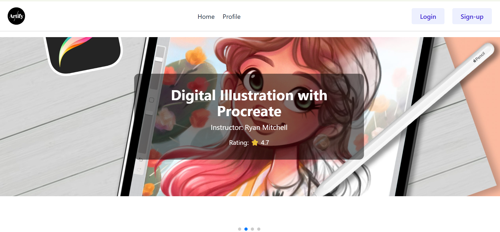

# Artify – Online Art Learning Site



## Project Description

Artify is an online art learning platform where users can explore different art skills, view details, and book learning sessions. The site includes login, registration, and profile management using Firebase authentication.

---

## Live URL

🔗 **[https://stellar-kitsune-e25f81.netlify.app/](https://stellar-kitsune-e25f81.netlify.app/)**

---

## Key Features

* Firebase Email/Password and Google authentication
* Login, Signup, and Forgot Password pages
* Protected routes (only logged-in users can view skill details)
* Update profile (name and photo)
* Responsive design for mobile, tablet, and desktop
* Hero slider, skill cards, and provider sections
* Toast notifications using react-hot-toast
* Animations using AOS and Swiper
* JSON data used for skill listings
* Environment variables used for Firebase configuration

---

## NPM Packages Used / Dependencies

### **Main Dependencies**

* **firebase** – Authentication and Firebase services
* **react-router-dom** – Client-side routing
* **react-hot-toast** – Notification alerts
* **aos** – Scroll animations
* **swiper** – Sliders and carousels
* **tailwindcss** – Utility-first CSS framework
* **daisyui** – Tailwind component library
* **react** – Core UI library
* **react-dom** – DOM rendering for React

### **Dev Dependencies**

* **vite** – Development server and build tool
* **postcss** – Tailwind CSS processor
* **autoprefixer** – Adds vendor prefixes to CSS

---

## How to Run on a Local Machine

### **1. Clone the Repository**

```bash
git clone https://github.com/Razaan-RR/Artify.git
```

### **2. Navigate to the Project Folder**

```bash
cd Artify
```

### **3. Install Dependencies**

```bash
npm install
```

### **4. Create Environment Variables**

Create a `.env.local` file in the project root:

```
VITE_apiKey=your_api_key
VITE_authDomain=your_auth_domain
VITE_projectId=your_project_id
VITE_storageBucket=your_storage_bucket
VITE_messagingSenderId=your_sender_id
VITE_appId=your_app_id
```

*(These values come from your Firebase project settings.)*

### **5. Start the Development Server**

```bash
npm run dev
```

### **6. Open in Browser**

Open the URL shown in your terminal, usually:

```
http://localhost:5173
```

Your project is now running locally! 🎨🚀
